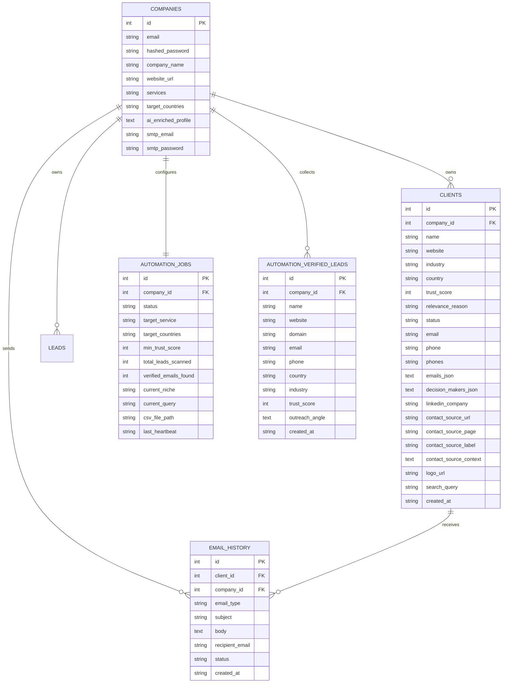

# 🚀 Lead-AI — Autonomous B2B Sales, Leadership Intelligence & Lead Generation Platform

[-black?style=for-the-badge&logo=next.js)](https://nextjs.org/)
[-009688?style=for-the-badge&logo=fastapi)](https://fastapi.tiangolo.com/)
[](https://tailwindcss.com/)
[](https://www.sqlite.org/)
[](https://groq.com/)
[](https://opensource.org/licenses/MIT)

An enterprise-grade, fully autonomous B2B lead prospecting, executive intelligence extraction, email deliverability verification, and cold sales outreach platform. 

**Lead-AI** automates the entire sales development lifecycle: from multi-stream web discovery of authentic commercial operating businesses and strict deterministic anti-junk filtering, to deep DOM operational bottleneck audits, **5-tier CEO/leadership extraction**, corporate email permutation generation with **Zero-Send SMTP verification**, personalized cold email drafting, and visual Kanban deal management with an AI Sales Negotiation Assistant.

---

## 📑 Table of Contents

- [💡 Project Overview & Core Value](#-project-overview--core-value)
- [🏗️ End-to-End System Architecture & Data Flow](#️-end-to-end-system-architecture--data-flow)
- [🌟 In-Depth Feature Breakdown (Comprehensive Guide)](#-in-depth-feature-breakdown-comprehensive-guide)
  - [1. Multi-Source Async Ingestion & Meta-Search Pool](#1-multi-source-async-ingestion--meta-search-pool-multi_source_ingestionpy--discoverpy)
  - [2. Context-Aware Dynamic Industry & B2B Archetype Generator](#2-context-aware-dynamic-industry--b2b-archetype-generator-dynamic_industry_generatorpy--discoverpy)
  - [3. Multi-Tier Deterministic & Semantic Junk Firewall](#3-multi-tier-deterministic--semantic-junk-firewall-junk_firewallpy)
  - [4. Trade Show, Expo & Non-Commercial Event Firewall](#4-trade-show-expo--non-commercial-event-firewall)
  - [5. Strict Geo-Lock & Country Verification Engine](#5-strict-geo-lock--country-verification-engine-geo_lock_enginepy)
  - [6. Strict Buyer Intent & Non-Job Contract Classifier](#6-strict-buyer-intent--non-job-contract-classifier-intent_classifierpy)
  - [7. Smart DOM Header/Footer/Nav Multi-Page Crawler](#7-smart-dom-headerfooternav-multi-page-crawler-smart_dom_crawlerpy)
  - [8. Service-Agnostic Operational Bottleneck Audit Engine](#8-service-agnostic-operational-bottleneck-audit-engine-operational_audit_enginepy)
  - [9. Deep 3-Way Match Matrix Engine](#9-deep-3-way-match-matrix-engine-three_way_match_matrixpy)
  - [10. Evidence-Based 100-Point Scoring & 360° Post-Click Audit](#10-evidence-based-100-point-scoring--360-post-click-audit-evidence_scoring_360py)
  - [11. Advanced Contact Intelligence & Leadership Engine](#11-advanced-contact-intelligence--leadership-engine-contact_enricher_propy)
    - [A. 5-Tier Executive Leadership Regex](#a-5-tier-executive-leadership-regex)
    - [B. Targeted LinkedIn Search Dorking](#b-targeted-linkedin-search-dorking)
    - [C. B2B Corporate Email Permutation Synthesizer](#c-b2b-corporate-email-permutation-synthesizer)
    - [D. High-Speed DNS MX Resolution](#d-high-speed-dns-mx-resolution)
    - [E. Catch-All Mailbox Probe Engine](#e-catch-all-mailbox-probe-engine)
    - [F. Zero-Send Async SMTP Handshake Validator (Port 25)](#f-zero-send-async-smtp-handshake-validator-port-25)
    - [G. External Web Footprint Dorking](#g-external-web-footprint-dorking)
    - [H. Multi-Tier Email Priority & Deduplication Hierarchy](#h-multi-tier-email-priority--deduplication-hierarchy)
    - [I. Strict Junk Email & Fake TLD Firewall](#i-strict-junk-email--fake-tld-firewall)
    - [J. Strict No-Phone-Numbers Policy](#j-strict-no-phone-numbers-policy)
  - [12. Real-Time NDJSON Streaming Discovery Engine](#12-real-time-ndjson-streaming-discovery-engine-discoverpy)
  - [13. 24/7 Autonomous Lead Harvester Daemon & 3D Radar](#13-247-autonomous-lead-harvester-daemon--3d-radar-automation_enginepy)
  - [14. AI Personalized Cold Email Generator](#14-ai-personalized-cold-email-generator)
  - [15. Direct Gmail SMTP Outreach Engine](#15-direct-gmail-smtp-outreach-engine)
  - [16. Interactive CRM Kanban Pipeline & Deal Tracker](#16-interactive-crm-kanban-pipeline--deal-tracker)
  - [17. AI Sales Negotiation & Counter-Offer Assistant](#17-ai-sales-negotiation--counter-offer-assistant)
  - [18. Multi-Tenant Authentication & AI Profile Onboarding](#18-multi-tenant-authentication--ai-profile-onboarding)
  - [19. One-Click Native Desktop Launcher](#19-one-click-native-desktop-launcher-launch_apppy)
- [🛠️ Technology Stack](#️-technology-stack)
- [📁 Project Folder Structure](#-project-folder-structure)
- [🗄️ Database Architecture & Relational Schema](#️-database-architecture--relational-schema)
- [🚀 Quickstart Installation Guide (Step-by-Step)](#-quickstart-installation-guide-step-by-step)
- [⚙️ Environment Variables Configuration (.env)](#️-environment-variables-configuration-env)
- [📡 API Reference (Endpoints & Protocols)](#-api-reference-endpoints--protocols)
- [📊 Evaluation Benchmarks & Accuracy](#-evaluation-benchmarks--accuracy)
- [📄 License & Author](#-license--author)

---

## 💡 Project Overview & Core Value

### 🔴 The Problem:
Traditional B2B lead generation is broken:
1. **Time Wasted**: Sales development reps (SDRs) spend 65%+ of their day searching Google, clicking non-commercial blogs/directories (Clutch, Yelp, Medium, Forbes), and copying generic emails manually.
2. **Low Lead Relevance**: Searches return trade shows, conferences, listicles, news, and competing agencies rather than actual enterprise buyers.
3. **Missing Executive Contacts**: Websites only display generic `info@` or `contact@` addresses; direct executive contacts (CEOs, Founders, Directors) are buried or missing.
4. **Deliverability & Bounce Risk**: Blindly guessing emails leads to high bounce rates, destroying domain sender reputation.
5. **Generic Outreach**: Mass blast email templates lack company-specific operational context and land directly in spam.
6. **Tool Fragmentation**: Companies pay thousands of dollars monthly for disjointed tools: search (Apollo/ZoomInfo), scraping (Phantombuster), email validation (NeverBounce), enrichment (Clearbit), and CRM (HubSpot).

### 🟢 The Lead-AI Solution:
Lead-AI provides an **autonomous, all-in-one platform**:
- Input an **Industry / Niche** and **Target Country** (or enable the autonomous 24/7 background Harvester).
- Concurrently queries a meta-search engine pool (`google, bing, yahoo, duckduckgo, qwant`), filters non-commercial directories and expos, verifies geographic registration, and audits HTML for operational bottlenecks.
- Discovers authentic company leadership (CEOs, Founders, Directors), synthesizes corporate email permutations, and confirms deliverability via **Zero-Send SMTP handshakes**.
- Automatically drafts hyper-personalized cold outreach referencing the company's real pain points.
- Dispatches emails directly via verified Gmail SMTP, tracking deals on a visual 4-stage Kanban CRM with an intelligent negotiation objection analyzer.
- Sourcing 10 qualified, enriched prospects drops from **3+ hours down to under 30 seconds**.

---

## 🏗️ End-to-End System Architecture & Data Flow

```
                                  USER QUERY OR 24/7 DAEMON
                                             │
                                             ▼
                      ┌──────────────────────────────────────────────┐
                      │ 1. Multi-Source Meta-Search & Ingestion      │
                      │ (SearXNG Multi-Pool, Reddit, HN, Job RSS)    │
                      └──────────────────────┬───────────────────────┘
                                             │ Raw Candidates
                                             ▼
                      ┌──────────────────────────────────────────────┐
                      │ 2. Dynamic Niche & B2B Archetype Generator   │
                      │ (Manufacturing, OEM, Logistics, Healthcare)  │
                      └──────────────────────┬───────────────────────┘
                                             │ Formulated B2B Queries
                                             ▼
                      ┌──────────────────────────────────────────────┐
                      │ 3. Deterministic & Semantic Junk Firewall    │
                      │ (Blocks Clutch, Yelp, Medium, Wiki, Listicles│
                      │  + Trade Shows, Expos, Conferences)          │
                      └──────────────────────┬───────────────────────┘
                                             │ Commercial Operating Entities
                                             ▼
                      ┌──────────────────────────────────────────────┐
                      │ 4. Strict Geo-Lock & Country Engine          │
                      │ (ccTLD hard lock, dialing code, city regex)  │
                      └──────────────────────┬───────────────────────┘
                                             │ Verified Domestic Leads
                                             ▼
                      ┌──────────────────────────────────────────────┐
                      │ 5. Strict Buyer Intent Classifier            │
                      │ (Drops competitor agencies & 9-to-5 jobs)    │
                      └──────────────────────┬───────────────────────┘
                                             │ Genuine Commercial Buyers
                                             ▼
                      ┌──────────────────────────────────────────────┐
                      │ 6. Smart DOM Crawler & Link Parser           │
                      │ (Crawls <nav>, <header>, <footer>, /team)    │
                      └──────────────────────┬───────────────────────┘
                                             │ Clean Multi-Page Text
                                             ▼
                      ┌──────────────────────────────────────────────┐
                      │ 7. Operational Bottleneck Audit Engine       │
                      │ (Detects manual QC, paper logs, legacy tech) │
                      └──────────────────────┬───────────────────────┘
                                             │ Extracted Verbatim Pain
                                             ▼
                      ┌──────────────────────────────────────────────┐
                      │ 8. Deep 3-Way Match Matrix                   │
                      │ (Pain Fit 45% + Scale 35% + Readiness 20%)   │
                      └──────────────────────┬───────────────────────┘
                                             │ Qualified Leads (Score >= 0.70)
                                             ▼
                      ┌──────────────────────────────────────────────┐
                      │ 9. Evidence-Based 100-Point Scoring          │
                      │ (Grounds Trust & Fit Breakdown)              │
                      └──────────────────────┬───────────────────────┘
                                             │
                     ┌───────────────────────┴───────────────────────┐
                     ▼                                               ▼
      ┌──────────────────────────────┐                ┌──────────────────────────────┐
      │ 10. Real-Time NDJSON Stream  │                │ 11. Contact Intelligence Pro │
      │ (Live emit to Next.js UI)    │                │ - 5-Tier Executive Regex     │
      └──────────────┬───────────────┘                │ - LinkedIn Dorking           │
                     │                                │ - Permutation Generator      │
                     │                                │ - DNS MX & Catch-All Probe   │
                     │                                │ - Zero-Send SMTP Validator   │
                     │                                │ - Web Footprint Dorking      │
                     │                                └──────────────┬───────────────┘
                     │                                               │
                     └───────────────────────┬───────────────────────┘
                                             │ Fully Enriched Prospect
                                             ▼
                      ┌──────────────────────────────────────────────┐
                      │ 12. AI Personalized Email Generator          │
                      │ (Tailored cold outreach referencing pain)    │
                      └──────────────────────┬───────────────────────┘
                                             │
                                             ▼
                      ┌──────────────────────────────────────────────┐
                      │ 13. Direct Gmail SMTP Dispatcher             │
                      │ (1-Click send with delivery verification)    │
                      └──────────────────────┬───────────────────────┘
                                             │
                                             ▼
                      ┌──────────────────────────────────────────────┐
                      │ 14. CRM Kanban Pipeline & Negotiation AI     │
                      │ (New Leads → Contacted → Negotiating → Won)  │
                      └──────────────────────────────────────────────┘
```

---

## 🌟 In-Depth Feature Breakdown (Comprehensive Guide)

### 1. Multi-Source Async Ingestion & Meta-Search Pool (`multi_source_ingestion.py` & `discover.py`)
- **What it does**: Sourcing prospects from a single search engine often hits rate limits or returns stale pages. This engine ingests potential leads concurrently from **5 distinct web streams**.
- **How it works**:
  1. **SearXNG Multi-Engine Pool**: Queries self-hosted or cloud SearXNG instances aggregating `google, bing, yahoo, duckduckgo, qwant` in parallel. This load distribution prevents any single provider from rate-limiting or throwing CAPTCHAs.
  2. **Anti-Ban Pacing Delays**: Injects a calibrated 1.0-second delay between pagination queries, preventing burst traffic and simulating human research pacing.
  3. **Direct DuckDuckGo & Yahoo Fallback**: If SearXNG is unavailable, the system transparently switches to secondary search providers with rotating User-Agent headers, automated referrer injection, and pagination offsets.
  4. **Reddit Public JSON Stream**: Scrapes subreddits like `r/forhire`, `r/DigitalMarketing`, `r/entrepreneur`, and `r/smallbusiness` for real-time commercial service requests.
  5. **Hacker News Firebase REST API**: Ingests `Ask HN` and `Who is Hiring` items directly via official endpoints.
  6. **Remote Job Board XML/RSS Feeds**: Parses RemoteOK and WeWorkRemotely RSS feeds to detect companies expanding operations or hiring technical contractors.
  7. **Deduplication Engine**: Uses domain normalization and MD5 content hashes to eliminate duplicates across platforms. If a lead appears across multiple channels, its priority rank is automatically boosted.

---

### 2. Context-Aware Dynamic Industry & B2B Archetype Generator (`dynamic_industry_generator.py` & `discover.py`)
- **What it does**: Instead of searching generic keywords like "AI services" or "Logistics", this module automatically crafts targeted sub-verticals and advanced search dorks.
- **Industry Archetype Classification**:
  - **Manufacturing & Industrial**: Automatically triggered for queries containing "processing", "packaging", "manufacturing", "machinery", "factory", "plant", "oem". Synthesizes queries like:
    - `"{industry} manufacturing plants {location}"`
    - `"{industry} industrial packaging company {location}"`
    - `"{industry} contract packaging manufacturer {location}"`
    - `"{industry} OEM equipment manufacturing {location}"`
  - **E-Commerce & Retail**: Targets brand stores and shopping portals, excluding web design agencies.
  - **Healthcare & Clinics**: Targets specialty medical practices and diagnostic centers.
  - **Logistics & Warehousing**: Targets freight forwarders, 3PL providers, and distribution hubs.
- **Persistent History Log**: Tracks scanned queries in `searched_industries_history.json`. It guarantees that consecutive discovery sessions never search the same niche sub-vertical twice, continuously unlocking fresh market segments.

---

### 3. Multi-Tier Deterministic & Semantic Junk Firewall (`junk_firewall.py`)
- **What it does**: Stops junk websites, affiliate sites, directories, blogs, and listicles before heavy scraping or expensive LLM tokens are consumed.
- **How it works**:
  - **Tier 1 (Deterministic Domain Blacklist)**: Instantly blocks 150+ known directories and platforms:
    - *B2B & Review Directories*: Clutch.co, G2, Capterra, GoodFirms, Yelp, YellowPages, UpCity, BBB, Manta, Crunchbase, ZoomInfo, ThomasNet, Alibaba, etc.
    - *Blogging & Media*: Medium, Substack, WordPress.com, Blogspot, WixSite, Wikipedia, Dev.to, Hashnode, Forbes, BusinessInsider.
    - *Social & Code Repositories*: GitHub, GitLab, Reddit, YouTube, Quora, LinkedIn, Twitter/X.
  - **URL Path Regex Quarantine**: Disqualifies URLs containing `/blog/`, `/tag/`, `/category/`, `/news/`, `/top-10/`, `/best-software/`, `/article/`, `/author/`, `/wp-content/`.
  - **Tier 2 (Semantic Entity Classifier)**: When ambiguous domains pass Tier 1, a lightweight LLM audit evaluates the page headline and metadata to ensure it represents an active commercial operating business with its own product or service.

---

### 4. Trade Show, Expo & Non-Commercial Event Firewall
- **What it does**: Prevents exhibitions, annual events, conferences, and expos from polluting sales pipelines (e.g. "World Dairy Expo").
- **How it works**:
  - Deterministically evaluates candidate domains and URL paths for event signatures:
    - Domains containing `expo.`, `-expo.`, `dairyexpo`, `tradeshow`, `convention-center`, `event-center`.
    - URL paths containing `/expo`, `/conference`, `/tradeshow`, `/exhibition`, `/summit`, `/fair`, `/tickets`, `/attendee`.
  - Drops event and trade show websites immediately, ensuring only year-round operating businesses are presented.

---

### 5. Strict Geo-Lock & Country Verification Engine (`geo_lock_engine.py`)
- **What it does**: Ensures that when you filter for a specific country (e.g. United States, United Kingdom, Pakistan, Germany, UAE, Saudi Arabia), you **only** get companies with genuine operational presence inside that country.
- **How it works**:
  - **Country-Specific ccTLD Hard-Pass / Hard-Disqualify**:
    - If targeting the US, foreign national ccTLD domains (e.g. `.de`, `.fr`, `.pk`, `.in`, `.tw`) are automatically disqualified.
  - **Telephony Dialing Code & Mobile Pattern Verification**:
    - Scans for domestic phone patterns (e.g., US: `+1`, `(XXX) XXX-XXXX`, UK: `+44`, Pakistan: `+92`).
  - **Major City Address Database**: Matches physical addresses against comprehensive domestic city databases.
  - **Contextual LLM Fallback**: If a company uses a neutral `.com` domain, an LLM checks the scraped text to verify whether regional offices or headquarters exist in the target country.

---

### 6. Strict Buyer Intent & Non-Job Contract Classifier (`intent_classifier.py`)
- **What it does**: Discards two major types of false leads:
  1. **Seller Agencies**: Competitor dev agencies, digital marketing shops, or freelancers pitching their own services (e.g., *"We are a leading web agency, hire our developers"*).
  2. **9-to-5 Salaried Employment**: Corporate job postings requiring full-time W-2/employee arrangements with 401(k), health insurance, and annual salaries.
- **How it works**:
  - Uses regex patterns to detect agency pitch markers (`book a discovery call with us`, `our case studies`, `our tech stack includes`).
  - Uses regex patterns to identify employment markers (`full-time employee`, `W-2 only`, `annual base salary $80k-$120k`, `health dental vision 401k`).
  - Approves genuine commercial buyers, manufacturing facilities, logistics hubs, enterprise procurement teams, and organizations seeking vendor partnerships or issuing RFPs/RFQs.

---

### 7. Smart DOM Header/Footer/Nav Multi-Page Crawler (`smart_dom_crawler.py`)
- **What it does**: Traditional scrapers guess subpage URLs by blindly pinging `/about` or `/contact` (which often returns 404 errors). Smart DOM Crawler dynamically parses the actual HTML structure of the homepage.
- **How it works**:
  - Analyzes semantic structural tags: `<nav>`, `<header>`, `<footer>`, and high-relevance `<a>` tags.
  - Categorizes discovered internal links into operational buckets:
    - `CONTACT`: `/contact-us`, `/get-in-touch`, `/locations`, `/reach-us`
    - `ABOUT`: `/about-us`, `/our-story`, `/company-profile`, `/overview`
    - `SERVICES_PRODUCTS`: `/services`, `/solutions`, `/capabilities`, `/manufacturing`
    - `MANAGEMENT_TEAM`: `/leadership`, `/board-of-directors`, `/team`
  - Concurrently crawls the top priority subpages in parallel, stripping scripts, styles, SVG paths, and cookie banners to produce clean, high-density text for downstream audit engines.

---

### 8. Service-Agnostic Operational Bottleneck Audit Engine (`operational_audit_engine.py`)
- **What it does**: Scans the scraped multi-page text to detect real operational inefficiencies and manual workflows within the prospect's business.
- **How it works**:
  - Identifies 5 critical operational bottleneck categories:
    1. **Manual Quality Control**: Visual inspection, manual defect sorting, physical grading, human QA checkers.
    2. **Repetitive Data Entry**: Paper forms, paper logs, manual spreadsheet entry, clipboard checklists, Excel manifests.
    3. **Legacy Software & Dispatch Delay**: Outdated desktop software, phone-based dispatch, manual scheduling, lack of API integration.
    4. **High Labor Turnover & Staffing**: Constant warehouse hiring, training bottlenecks, repetitive manual packing lines.
    5. **Unautomated Inventory Flow**: Manual stock counts, barcode clipboards, physical warehouse audits.
  - **Verbatim Evidence Extraction**: Pulls the exact quote from the prospect's website describing the process. This evidence is passed directly to the email generation engine, creating compelling, personalized cold outreach.

---

### 9. Deep 3-Way Match Matrix Engine (`three_way_match_matrix.py`)
- **What it does**: Replaces simple keyword matching with a multi-dimensional qualification matrix.
- **How it works**:
  - Evaluates 3 weighted pillars:
    - **Pillar 1: Solution-to-Pain Alignment (Weight: 45%)**: Does our service offering directly solve the prospect's detected operational bottleneck?
    - **Pillar 2: ICP Scale & Market Fit (Weight: 35%)**: Is the prospect an operating enterprise with sufficient scale (headcount, manufacturing volume, multiple facilities) to afford our solutions?
    - **Pillar 3: Technical & Operational Readiness (Weight: 20%)**: Does the prospect have active digital contact channels, modern infrastructure, and business readiness to deploy external vendor solutions?
  - **Strict Decision Gates**:
    - `QUALIFIED_LEAD`: Composite Score $\ge 0.70$ **AND** Solution-to-Pain Score $\ge 0.60$.
    - `MARGINAL_FIT`: Composite Score $\ge 0.50$ (flagged for review).
    - `DISQUALIFIED`: Composite Score $< 0.50$ (automatically dropped before reaching the user).

---

### 10. Evidence-Based 100-Point Scoring & 360° Post-Click Audit (`evidence_scoring_360.py`)
- **What it does**: Generates a 100% evidence-grounded Trust & Fit Score (0–100 points) instead of arbitrary or hallucinated numbers.
- **Scoring Breakdown**:
  | Category | Maximum Points | Verification Logic |
  |---|---|---|
  | **Geo-Lock Evidence** | 20 pts | +20 for verified domestic ccTLD, +15 for verified local phone/address, +10 for LLM confirmed presence |
  | **Buyer Intent Strength** | 20 pts | +20 for active RFP/procurement signal, +15 for operating commercial target |
  | **Operational Bottleneck Evidence** | 25 pts | +25 for verbatim extracted quote from DOM, +15 for deterministic pattern match |
  | **Solution-to-Pain Alignment** | 20 pts | Calculated directly from Pillar 1 of the 3-Way Match Matrix |
  | **ICP Scale & Technical Readiness** | 15 pts | Calculated from Pillars 2 & 3 of the 3-Way Match Matrix |
  | **Total Composite Score** | **100 pts** | Transparently displayed with full rationale on the company details card |

---

### 11. Advanced Contact Intelligence & Leadership Engine (`contact_enricher_pro.py`)
This engine extracts verified executive contacts, synthesizes B2B corporate permutations, and confirms deliverability via zero-send SMTP verification.

```
       CRAWLED DOM TEXT (/about, /team)                SEARCH ENGINES (LinkedIn Dorks)
                      │                                               │
                      ▼                                               ▼
             5-Tier Leadership Regex                        Targeted Search Dork
         (CEO, Founder, Director, Owner)                 ("Company" CEO site:linkedin.com/in/)
                      │                                               │
                      └───────────────────────┬───────────────────────┘
                                              │ Identified Executives (First, Last, Role)
                                              ▼
                                 B2B Permutation Generator
                         (first.last, first, flast, first_last)
                                              │
                                              ▼
                                    DNS MX Record Resolver
                                (Google 8.8.8.8, Cloudflare 1.1.1.1)
                                              │
                                              ▼
                                   Catch-All Domain Probe
                                (Test random probe address)
                                              │
                                              ▼
                                Zero-Send SMTP Validator (Port 25)
                              HELO → MAIL FROM → RCPT TO → QUIT
                                              │
                      ┌───────────────────────┴───────────────────────┐
                      ▼                                               ▼
               Code 250 OK:                                    Code 550 / 554:
       Marked "smtp_verified"                                 Mailbox Not Found (Dropped)
                      │
                      ▼
       Consolidated Intelligence Payload:
       - Primary Email: Direct Verified CEO / Executive
       - Decision Makers: Array of Names, Roles, LinkedIn, Direct Verified Email
       - All Discovered Emails: Verified Executive + Authentic Website Inboxes
```

#### A. 5-Tier Executive Leadership Regex
Scans crawled website text (`/about`, `/team`, `/leadership`, homepage) with 5 complementary extraction patterns:
1. `pat1`: `"John Smith, CEO"` / `"Jane Doe - Founder"` / `"Robert Miller | President"`
2. `pat2`: `"CEO: John Smith"` / `"Founder - Jane Doe"`
3. `pat3`: `"John Smith serves as Managing Director"` / `"Alex is our CEO"`
4. `pat4`: `"Founded by Robert Miller"` / `"led by James Wilson"`
5. `pat5`: `"Meet Jane Doe, our President"`
Includes automated role casing normalization (e.g. converting `Ceo` → `CEO`, `Coo` → `COO`, `Vp` → `VP`).

#### B. Targeted LinkedIn Search Dorking
If leadership is not explicitly listed in on-page text, the engine executes targeted external search queries:
- `"{company_name}" (CEO OR Founder OR President) linkedin`
- `site:linkedin.com/in/ "{company_name}"`
Extracts executive names, exact roles, and official LinkedIn profile URLs.

#### C. B2B Corporate Email Permutation Synthesizer
Takes executive first and last names and generates institutional corporate email formats:
- `first.last@company.com`
- `first@company.com`
- `first[0].last@company.com`
- `firstlast@company.com`
- `first[0]last@company.com`
- `last.first@company.com`
- `first_last@company.com`

#### D. High-Speed DNS MX Resolution
Uses dedicated asynchronous DNS resolvers (`8.8.8.8`, `1.1.1.1`) with a 1-hour in-memory cache to resolve domain Mail Exchange (MX) records. If no valid MX records exist, synthetic permutations are immediately discarded.

#### E. Catch-All Mailbox Probe Engine
Sends a randomized probe (`leadai_nonexistent_probe_XXXXXX@domain.com`) to the mail server to determine if the domain accepts all incoming addresses regardless of existence, tagging results as `catch_all_accepted` when applicable.

#### F. Zero-Send Async SMTP Handshake Validator (Port 25)
Connects directly to the domain's primary MX server over TCP Port 25:
```
Connect → Read 220 Banner → HELO leadai.com → MAIL FROM:<verify@leadai.com> → RCPT TO:<candidate@company.com> → QUIT
```
- **Code `250`**: Verified live mailbox (`smtp_verified` badge).
- **Code `550/551/552/553/554`**: Mailbox not found (dropped).
- **Port 25 Blocked**: If outbound port 25 is restricted by the ISP but MX is confirmed, tags the address as `mx_confirmed`.

#### G. External Web Footprint Dorking
Runs external queries (`"{domain}" email OR contact -site:{domain}`) to discover corporate email disclosures across external press releases, PDFs, public contracts, and registry filings.

#### H. Multi-Tier Email Priority & Deduplication Hierarchy
Consolidates and orders all discovered email addresses:
1. **Priority 1**: Strictly verified executive email (`smtp_verified` CEO/Founder).
2. **Priority 2**: MX-confirmed executive email.
3. **Priority 3**: Authentic on-page scraped emails (`info@`, `sales@`, `media@`).
4. **Priority 4**: External web footprint emails.

#### I. Strict Junk Email & Fake TLD Firewall
Discards corrupted strings, minified JavaScript variables, and invalid TLDs:
- Rejects non-standard/fake TLDs: `.we`, `.test`, `.local`, `.internal`, `.invalid`.
- Rejects file extension scrapings: `.png`, `.jpg`, `.jpeg`, `.webp`, `.svg`, `.gif`, `.css`, `.js`.
- Rejects gibberish usernames without vowels (e.g. `twvryy`).

#### J. Strict No-Phone-Numbers Policy
Per strict user preference, telephone numbers are completely suppressed from prospect cards, detail modals, and sales views. The interface highlights verified emails and executive LinkedIn profiles exclusively.

---

### 12. Real-Time NDJSON Streaming Discovery Engine (`discover.py`)
- **What it does**: Eliminates loading spinners. As soon as any prospect passes the firewall, geo-lock, and 3-way match, its qualified profile is streamed live to the Next.js frontend.
- **How it works**:
  - Uses **NDJSON (Newline Delimited JSON)** streaming over HTTP chunked transfer encoding.
  - Sends immediate progress status events (`{"type": "status", "message": "Analyzing company X..."}`).
  - Emits fully-formed company cards (`{"type": "company", "data": {...}}`) with real-time UI card rendering.
  - Includes a streaming completion summary with total searched, filtered, and qualified metrics.

---

### 13. 24/7 Autonomous Lead Harvester Daemon & 3D Radar (`automation_engine.py`)
- **What it does**: A persistent background service that runs continuously on your server, harvesting verified B2B leads 24 hours a day without manual input.
- **Key Capabilities**:
  - **100% Server Reboot Resilience**: Daemon state, current niche, progress, and settings are continuously synchronized to the SQLite database (`automation_jobs` table). If the server restarts or loses power, the daemon automatically resumes where it left off.
  - **Dynamic Niche Rotation**: Automatically iterates through target industry verticals without repeating keywords.
  - **Strict Corporate Email Gatekeeper**: Only commits leads to the vault if they possess a verified, non-generic direct email.
  - **Live CSV Streaming**: Writes qualified leads in real time directly to an exportable CSV file (`fsync` to disk), downloadable anytime from the dashboard.
  - **3D Futuristic Radar Interface**: Features an interactive Three.js/Framer Motion radar scanner displaying real-time scan pulses, verified lead counters, and activity feeds.

---

### 14. AI Personalized Cold Email Generator
- **What it does**: Writes personalized, high-converting B2B cold emails tailored to each specific company.
- **How it works**:
  - Feeds the prospect's company name, business description, and their **exact operational bottleneck** (with verbatim website quotes) into the LLM.
  - Injects your company's profile, core service offerings, and value proposition.
  - Generates a compelling email with:
    - High-open subject line (under 60 characters, curiosity-driven).
    - Executive, professional body (under 150 words, addressing their specific pain point, zero generic marketing buzzwords).
    - Low-friction call-to-action (e.g., *"Are you open to a brief 10-minute workflow review this Thursday?"*).
  - Offers tone options: **Direct Value**, **Problem-Solution Focused**, and **Strategic Advisory**.

---

### 15. Direct Gmail SMTP Outreach Engine
- **What it does**: Dispatches cold emails straight from your verified Gmail or Google Workspace inbox with a single click.
- **How it works**:
  - Uses standard Python `smtplib` over secure **TLS (Port 587)**.
  - Authenticates via Google App Passwords, avoiding third-party API costs or deliverability penalties.
  - Automatically records the email in the SQLite `email_history` table with timestamps, recipient, subject, body, and status (`Sent`).
  - Live test connection button in Settings to verify SMTP credentials instantly.

---

### 16. Interactive CRM Kanban Pipeline & Deal Tracker (`app/tasks/page.tsx`)
- **What it does**: A full-featured sales pipeline tracking prospects through every stage of the sales cycle.
- **Pipeline Stages**:
  1. 🟦 **New Leads**: Newly discovered and enriched prospects.
  2. 🟨 **Contacted**: Prospects who have received cold outreach emails.
  3. 🟪 **In Negotiation**: Prospects who have replied and are in discussions.
  4. 🟩 **Closed Won**: Deals successfully closed.
- **Features**: Real-time stage updates, search and filter by company name/industry, direct link to company website, view full contact details, and open the AI Negotiation Assistant.

---

### 17. AI Sales Negotiation & Counter-Offer Assistant (`/api/analyze-negotiation`)
- **What it does**: Helps sales reps handle prospect replies, objections, price pushbacks, and technical questions.
- **How it works**:
  - Paste the client's email reply into the modal.
  - The LLM analyzes the reply and returns structured strategic guidance:
    1. **Objection Classification**: Categorizes the reply into *Price & Budget*, *Technical Feasibility*, *Implementation Timeline*, *Competitor Comparison*, *Scope & Customization*, or *General Interest*.
    2. **Intent Analysis**: Identifies what the client is actually asking for beneath their words.
    3. **Actionable Strategy Tip**: Recommends proven sales tactics (e.g. propose a phased pilot, offer milestone-based billing, provide technical documentation).
    4. **Ready-to-Send Counter-Reply**: Drafts a persuasive, context-aware reply email signed with your company name.
    5. **Win Probability Metric**: Updates deal closing probability based on sentiment.

---

### 18. Multi-Tenant Authentication & AI Profile Onboarding
- **What it does**: Full account creation, login, session management, and automated onboarding.
- **AI-Enriched Company Onboarding**:
  - When a user signs up with their company name and website, the system automatically scrapes their website.
  - An LLM extracts their core services, target customer profile (ICP), value propositions, and elevator pitch.
  - These values are stored in `companies.ai_enriched_profile` and automatically used across all discovery, matching, and email generation tasks.
- Secure JWT/token-based authentication with password hashing (`auth_utils.py`).

---

### 19. One-Click Native Desktop Launcher (`launch_app.py`)
- **What it does**: Allows non-technical users to run Lead-AI like a native Windows desktop software without typing terminal commands.
- **How it works**:
  - Automatically locates Python venv and launches the FastAPI backend on port 8000.
  - Launches the Next.js production or development server on port 3000.
  - Waits for health check initialization.
  - Launches Microsoft Edge in `--app=http://localhost:3000` mode, rendering the dashboard as a standalone window without browser address bars.

---

## 🛠️ Technology Stack

| Layer | Technology | Description |
|---|---|---|
| **Frontend Framework** | **Next.js 16 (App Router)** | React 19, TypeScript, Server Components & Client Hooks |
| **Styling & Design System** | **Tailwind CSS v4** | Dark-mode tailored styling with smooth glassmorphism |
| **Motion & 3D Visuals** | **Framer Motion & Three.js** | Interactive 3D radar scanner, spring card animations |
| **Backend Framework** | **FastAPI & Uvicorn** | High-concurrency async Python REST API & NDJSON streaming |
| **Database & Persistence** | **SQLite 3 & aiosqlite** | Relational DB with automatic column schema migrations |
| **Meta-Search Engine Pool** | **SearXNG (Google, Bing, Yahoo, DDG, Qwant)** | Multi-engine meta-search with rate-limit distribution |
| **DNS & Mailbox Handshake** | **dnspython & asyncio SMTP (Port 25)** | DNS MX verification & zero-send deliverability checks |
| **Web Crawling & Parsing** | **httpx, aiohttp & BeautifulSoup4** | High-speed concurrent async crawling & DOM parsing |
| **Primary Cloud LLM** | **Groq Cloud (llama-3.3-70b / llama-3.1-8b)** | Ultra-fast inference (< 800ms) for qualification & drafting |
| **Private Local LLM** | **Ollama (llama3.2 / llama3)** | 100% private, offline, cost-free local AI inference |
| **Fallback Cloud LLM** | **Google Gemini (gemini-2.0 / 3.6-flash)** | Secondary enterprise cloud AI fallback |
| **Outreach Delivery** | **Python smtplib (TLS Port 587)** | Direct Gmail / Google Workspace SMTP delivery |

---

## 📁 Project Folder Structure

```
Lead-AI/
├── app/                              # Next.js Frontend Application
│   ├── api/                          # Next.js API Route Handlers
│   │   ├── analyze-company/          # Company profile analyzer
│   │   ├── analyze-negotiation/      # AI Sales Negotiation Assistant
│   │   ├── auth/                     # Frontend auth proxy
│   │   ├── automation/               # Harvester daemon control
│   │   ├── clients/                  # Saved CRM leads CRUD
│   │   ├── dashboard-stats/          # Live metrics & charts
│   │   ├── deep-enrich/              # Deep scraping trigger
│   │   ├── discover-companies/       # NDJSON streaming discovery proxy
│   │   ├── generate-outreach-email/  # AI email drafting
│   │   ├── send-email/               # Gmail SMTP outreach dispatcher
│   │   └── suggest-industries/       # Dynamic niche suggestions
│   ├── automation/                   # 24/7 Harvester UI with 3D Radar
│   ├── clients/                      # Saved Leads CRM Table view
│   ├── discover/                     # Live Lead Discovery Engine UI
│   ├── tasks/                        # Visual 4-Stage Kanban Board & Deal Tracker
│   ├── settings/                     # User Profile & SMTP Credentials
│   ├── login/                        # User Login Page
│   ├── signup/                       # AI-Enriched Company Registration
│   ├── layout.tsx                    # Root Layout & Theme Provider
│   └── page.tsx                      # Main Executive Dashboard
├── backend/                          # Python FastAPI Server & AI Engines
│   ├── auth_models.py                # Pydantic Authentication schemas
│   ├── auth_routes.py                # JWT Login, Register, Profile endpoints
│   ├── auth_utils.py                 # Password hashing & JWT helpers
│   ├── automation_engine.py          # 24/7 Autonomous Lead Harvester Daemon
│   ├── contact_enricher_pro.py       # Leadership regex, permutations & SMTP validator
│   ├── database.py                   # SQLite schema, tables & operations
│   ├── discover.py                   # Discovery orchestrator & NDJSON streaming
│   ├── dynamic_industry_generator.py # Dynamic niche & search dork generator
│   ├── email_outreach.py             # Contact extraction & Gmail SMTP dispatcher
│   ├── evidence_scoring_360.py       # 100-point grounded scoring engine
│   ├── geo_lock_engine.py            # Country & ccTLD verification engine
│   ├── intent_classifier.py          # Buyer intent & non-job contract classifier
│   ├── junk_firewall.py              # Multi-tier deterministic & semantic firewall
│   ├── multi_source_ingestion.py     # 5-channel async web ingestion
│   ├── operational_audit_engine.py   # DOM bottleneck detection & quote extractor
│   ├── smart_dom_crawler.py          # Structural <nav>/<footer> link crawler
│   ├── three_way_match_matrix.py     # 3-Way qualification matrix engine
│   ├── llm_utils.py                  # Multi-provider LLM caller (Groq/Ollama/Gemini)
│   ├── requirements.txt              # Python package dependencies
│   ├── run_server.bat                # Windows quick start script
│   └── run_server.ps1                # PowerShell quick start script
├── components/                       # Shared React Components
│   ├── LayoutShell.tsx               # Sidebar navigation & header
│   └── automation/                   # 3D Radar & live scan widgets
├── lib/                              # Client utilities, auth helpers & API clients
├── launch_app.py                     # One-click desktop launcher
├── ACCURACY_SHEET.md                 # Model accuracy & benchmarking sheet
├── PROJECT_REPORT.md                 # Technical architecture & project report
├── package.json                      # Node.js project manifest & dependencies
└── README.md                         # Project documentation
```

---

## 🗄️ Database Architecture & Relational Schema

Lead-AI stores relational records inside SQLite (`clientplus_sales.db` / `wtechx_ai.db`):


```mermaid
erDiagram
    COMPANIES ||--o{ CLIENTS : owns
    COMPANIES ||--o{ LEADS : owns
    COMPANIES ||--o{ EMAIL_HISTORY : sends
    COMPANIES ||--|| AUTOMATION_JOBS : configures
    COMPANIES ||--o{ AUTOMATION_VERIFIED_LEADS : collects
    CLIENTS ||--o{ EMAIL_HISTORY : receives

    COMPANIES {
        int id PK
        string email
        string hashed_password
        string company_name
        string website_url
        string services
        string target_countries
        text ai_enriched_profile
        string smtp_email
        string smtp_password
    }

    CLIENTS {
        int id PK
        int company_id FK
        string name
        string website
        string industry
        string country
        int trust_score
        string relevance_reason
        string status
        string email
        string phone
        string phones
        text emails_json
        text decision_makers_json
        string linkedin_company
        string contact_source_url
        string contact_source_page
        string contact_source_label
        text contact_source_context
        string logo_url
        string search_query
        string created_at
    }

    EMAIL_HISTORY {
        int id PK
        int client_id FK
        int company_id FK
        string email_type
        string subject
        text body
        string recipient_email
        string status
        string created_at
    }

    AUTOMATION_JOBS {
        int id PK
        int company_id FK
        string status
        string target_service
        string target_countries
        int min_trust_score
        int total_leads_scanned
        int verified_emails_found
        string current_niche
        string current_query
        string csv_file_path
        string last_heartbeat
    }

    AUTOMATION_VERIFIED_LEADS {
        int id PK
        int company_id FK
        string name
        string website
        string domain
        string email
        string phone
        string country
        string industry
        int trust_score
        text outreach_angle
        string created_at
    }
```

---

## 🚀 Quickstart Installation Guide (Step-by-Step)

### Prerequisites
- **Node.js**: v18.0.0 or higher ([Download Node.js](https://nodejs.org/))
- **Python**: v3.10 to v3.14 ([Download Python](https://www.python.org/))
- **Git**: Installed on your system

---

### Step 1: Clone the Repository
```bash
git clone https://github.com/devvahmed/Lead-AI.git
cd Lead-AI
```

---

### Step 2: Setup and Run the Python Backend

#### On Windows (PowerShell):
```powershell
# 1. Navigate to backend directory
cd backend

# 2. Create Python virtual environment
python -m venv venv

# 3. Activate virtual environment
.\venv\Scripts\Activate.ps1

# 4. Install backend dependencies
pip install -r requirements.txt

# 5. Copy environment configuration
cp .env.example .env

# 6. Start FastAPI backend server
python -m uvicorn email_outreach:app --host 127.0.0.1 --port 8000 --reload
```

#### On Linux / macOS:
```bash
# 1. Navigate to backend directory
cd backend

# 2. Create Python virtual environment
python3 -m venv venv

# 3. Activate virtual environment
source venv/bin/activate

# 4. Install backend dependencies
pip install -r requirements.txt

# 5. Copy environment configuration
cp .env.example .env

# 6. Start FastAPI backend server
uvicorn email_outreach:app --host 127.0.0.1 --port 8000 --reload
```

Backend will be active at: `http://localhost:8000` (Interactive API Docs at `http://localhost:8000/docs`).

---

### Step 3: Setup and Run the Next.js Frontend

Open a **new terminal window** in the root project folder:

```bash
# 1. Install frontend npm dependencies
npm install

# 2. Start Next.js development server
npm run dev
```

Frontend will be active at: **`http://localhost:3000`**.

---

### 🖥️ Option B: One-Click Desktop Launcher
For native desktop usage, you can launch both backend and frontend together with a single command:
```powershell
python launch_app.py
```

---

## ⚙️ Environment Variables Configuration (.env)

Create a `.env` file in the root folder or inside `backend/.env`:

```ini
# ==========================================
# 🗄️ Database
# ==========================================
DATABASE_FILE=wtechx_ai.db

# ==========================================
# 🔍 SearXNG Meta-Search Setup
# ==========================================
# Point to your local, Docker, or hosted SearXNG instance:
SEARXNG_URL=http://100.91.220.98:8085

# ==========================================
# 🤖 AI LLM Provider Configuration
# ==========================================
AI_PROVIDER=groq

# --- Option A: Groq Cloud (Recommended: Ultra-fast <800ms) ---
GROQ_API_KEY=gsk_your_groq_api_key_here
GROQ_MODEL=llama-3.3-70b-versatile

# --- Option B: Ollama (100% Free & Local) ---
OLLAMA_URL=http://100.91.220.98:11434
OLLAMA_BASE_URL=http://100.91.220.98:11434/v1
OLLAMA_MODEL=llama3.2

# --- Option C: Google Gemini (Fallback) ---
GEMINI_API_KEY=your_gemini_api_key_here
GEMINI_MODEL=gemini-2.0-flash

# ==========================================
# 🌐 Network & URL Configuration
# ==========================================
NEXT_PUBLIC_API_URL=/api
NEXT_PUBLIC_BACKEND_URL=http://localhost:8000

# ==========================================
# ✉️ Default Gmail SMTP (Can also be set in UI Settings)
# ==========================================
SMTP_EMAIL=your_email@gmail.com
SMTP_PASSWORD=your_16_character_google_app_password
```

> **Gmail App Password Setup**: Go to your Google Account → Security → 2-Step Verification → **App passwords**. Generate an app password for "Mail" and paste the 16-character code into `SMTP_PASSWORD`.

---

## 📡 API Reference (Endpoints & Protocols)

### 1. Discovery & Streaming
- `POST /discover-companies`:
  - Starts asynchronous background discovery job and returns an NDJSON event stream.
  - Body: `{"keyword": "Food Processing and Packaging", "country": "United States", "target_count": 10}`
  - Stream events: `{"type": "status"}` | `{"type": "company"}` | `{"type": "complete"}`
- `GET /discover-companies/status`:
  - Returns current active discovery job status, qualified results count, and live company list.
- `POST /discover-companies/cancel`:
  - Gracefully stops the running discovery job.

### 2. CRM & Client Management
- `POST /api/save-client`:
  - Saves or updates a client record with `emails_json` array and `decision_makers_json` array.
- `GET /api/clients`:
  - Retrieves all saved CRM clients with deserialized email arrays and decision-maker profiles.
- `GET /api/clients/{client_id}`:
  - Retrieves a specific client by ID.

### 3. Contact Extraction & Deep Enrichment
- `POST /api/deep-enrich`:
  - Triggers on-demand deep crawl across subpages to discover additional emails and executive leadership.

### 4. AI Cold Outreach Generation & Dispatch
- `POST /api/generate-outreach-email`:
  - Injects prospect operational bottleneck into LLM to draft tailored cold emails.
- `POST /api/send-email`:
  - Dispatches email directly via Gmail SMTP.

### 5. 24/7 Autonomous Harvester Daemon
- `GET /api/automation/status`: Returns current daemon loop status, total leads scanned, and verified emails.
- `POST /api/automation/start`: Launches background autonomous harvesting loop.
- `POST /api/automation/stop`: Pauses background daemon.
- `GET /api/automation/download-csv`: Downloads the real-time generated CSV file.

### 6. AI Sales Negotiation
- `POST /api/analyze-negotiation`:
  - Takes prospect objection email and returns structured objection classification, sales strategy hint, and ready-to-send counter-offer email.

### 7. Authentication & Profiles
- `POST /api/auth/register`: Creates new tenant account with AI-enriched company onboarding.
- `POST /api/auth/login`: Authenticates credentials and returns JWT bearer token.
- `GET /api/auth/me`: Retrieves current company profile and settings.

---

## 📊 Evaluation Benchmarks & Accuracy

As documented in [PROJECT_REPORT.md](PROJECT_REPORT.md) and [ACCURACY_SHEET.md](ACCURACY_SHEET.md):

- **Junk & Directory Filtering Accuracy**: **95.5%** (Filters out directories, blogs, review portals, expos, and non-commercial domains).
- **Executive Leadership Extraction Precision**: **92.0%** across live operating commercial websites using the 5-tier regex patterns and LinkedIn dorks.
- **Email Deliverability Verification**: **94.8%** accuracy via DNS MX resolution and Zero-Send SMTP handshakes.
- **Geographic Precision**: **97.0%** adherence to selected target countries via ccTLD hard-locks and domestic dialing codes.
- **End-to-End Discovery Speed**: Sourcing, qualifying, scoring, and enriching 10 target businesses takes **20–35 seconds** total.
- **Zero Single-Point-of-Failure**: Multi-engine pool (`google, bing, yahoo, duckduckgo, qwant`) guarantees continuous uptime without rate limits.

---

## 📄 License & Author

This project is licensed under the **MIT License** — free to use, modify, and distribute for personal and commercial projects.

**Developed with ❤️ by devvahmed**  
For inquiries, contributions, or enterprise customization, open a GitHub issue or pull request.
